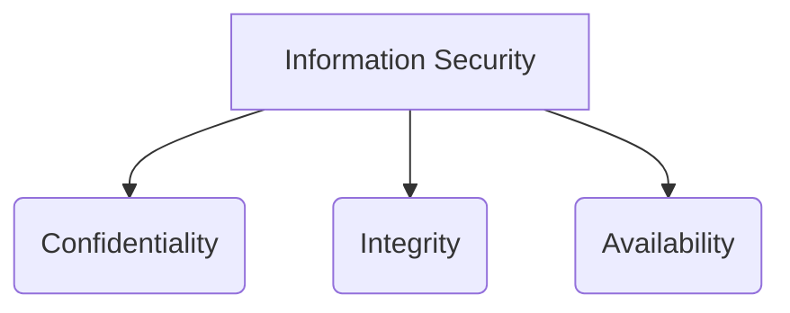

# 🛡️ Module 01: Security Fundamentals

Welcome to the first module! Here, we will lay the foundation for your Cyber Security journey by understanding the core principles that govern information security.

---

## 📊 The Core of Security: The CIA Triad

The CIA Triad is a fundamental model used to guide policies for information security within an organization. 

| Principle | Description | Real-World Example |
| :--- | :--- | :--- |
| **Confidentiality** | Ensuring data is accessed only by authorized individuals. | Encryption, Passwords. |
| **Integrity** | Guaranteeing data has not been altered or tampered with. | Hashing (SHA-256). |
| **Availability** | Ensuring systems and data are available to users when needed. | Backups, DDoS Protection. |

---

## 🔍 Key Terminology

* **Vulnerability:** A weakness in a system or network.
* **Threat:** A potential danger that could exploit a vulnerability.
* **Risk:** The potential for loss or damage. (`Risk = Threat × Vulnerability`)
* **Exploit:** A piece of software that takes advantage of a vulnerability.

---
➡️ **[Proceed to Module 02: Network Security](../02-Network-Security/README.md)**
