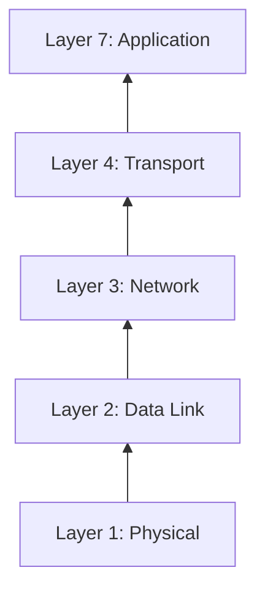

# 🌐 Module 02: Network Security

Welcome to Network Security! In this module, we explore how data travels across the internet and how to secure networks.

---

## 🏗️ The OSI Model

Understanding the OSI model is crucial for troubleshooting and identifying where an attack is taking place.

---

## 🚪 Common Network Ports

As a security professional, you must memorize common ports:

| Port | Protocol | Security Risk / Note |
| :---: | :--- | :--- |
| **21** | FTP | Data sent in plaintext. Highly vulnerable. |
| **22** | SSH | Secure remote access. |
| **80** | HTTP | Web traffic in plaintext. Susceptible to sniffing. |
| **443** | HTTPS| Encrypted web traffic. |

---
⬅️ **[Back to Module 01](../01-Security-Fundamentals/README.md)** | ➡️ **[Proceed to Module 03](../03-Web-Application-Security/README.md)**
