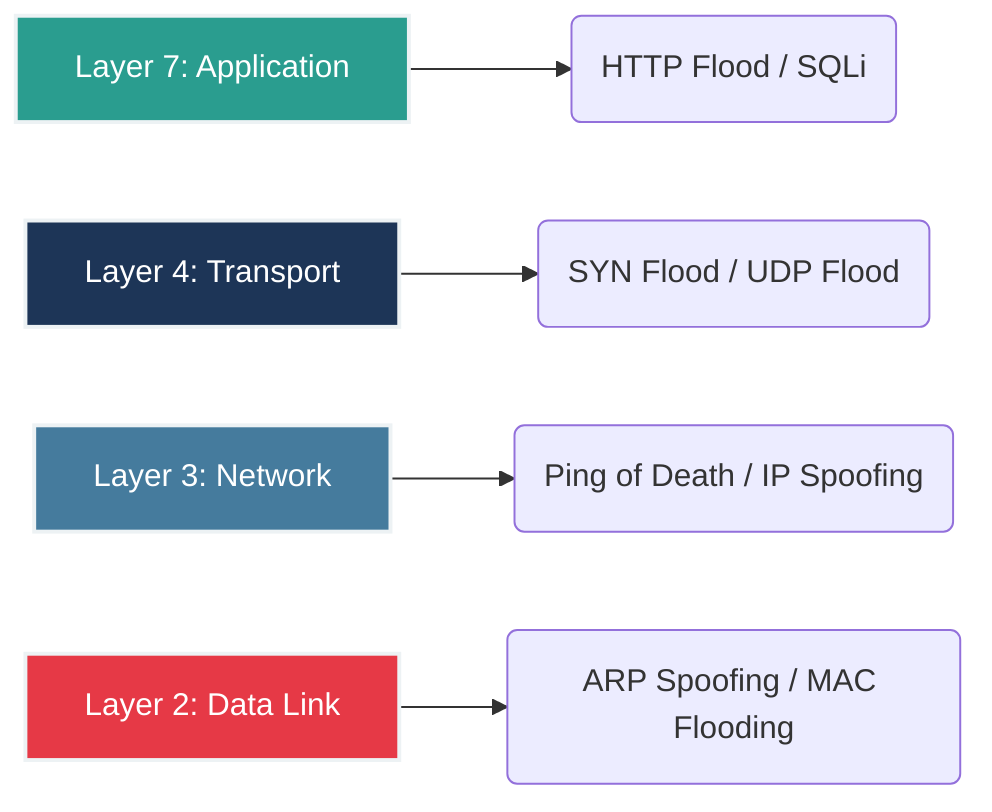
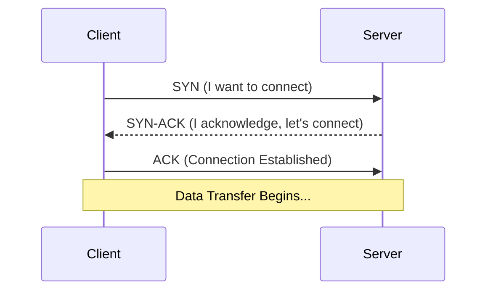

# 🌐 Module 02: Advanced Network Security

Network security requires a deep understanding of how packets traverse the wire. In this module, we dissect protocols, analyze network-level attacks, and explore enterprise network defenses.

---

## 🏗️ The OSI Model & Associated Attacks

Hackers target specific layers of the OSI model. Understanding this is crucial for deploying the correct countermeasures.

---

## 🤝 TCP 3-Way Handshake & SYN Floods

Before any data is transmitted over TCP, a connection must be established. This is a common target for Denial of Service (DoS) attacks.

**The SYN Flood Attack:** An attacker sends millions of `SYN` requests but never replies with the final `ACK`. The server leaves connections half-open, exhausting its memory and crashing the service.

---

## 🔍 Advanced Network Scanning (Nmap)

Professional penetration testers do not rely on basic scans. They use advanced flags to evade firewalls and gather precise intelligence.

| Command | Purpose | Explanation |
| :--- | :--- | :--- |
| `nmap -sS <target>` | **TCP SYN Stealth Scan** | Sends SYN packets but tears down the connection before it's logged by the target firewall. |
| `nmap -sV -O <target>`| **Version & OS Detection** | Probes open ports to determine the exact software versions and the underlying Operating System. |
| `nmap -T4 -A <target>`| **Aggressive Scan** | Fast execution, enables OS detection, version detection, script scanning, and traceroute. |
| `nmap --script vuln` | **Nmap Scripting Engine (NSE)**| Automates vulnerability detection against the target using a massive database of scripts. |

---

## 🛡️ Enterprise Network Defenses

1. **Next-Generation Firewalls (NGFW):** Unlike traditional firewalls that only look at IP addresses and ports, NGFWs perform Deep Packet Inspection (DPI) and Application Awareness.
2. **SIEM (Security Information and Event Management):** Centralized platforms (like Splunk or IBM QRadar) that aggregate logs from all network devices to detect anomalies in real-time.

---
⬅️ **[Back to Module 01](../01-Security-Fundamentals/README.md)** | ➡️ **[Proceed to Module 03](../03-Web-Application-Security/README.md)**
