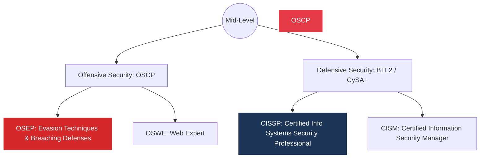

# 🛠️ Module 05: Enterprise Tooling & Career Trajectory

To excel in Cyber Security, you must master the tools used by industry professionals and pursue certifications that validate your high-level technical expertise.

---

## 🛡️ Enterprise-Grade Security Arsenal

While open-source tools are great for learning, enterprises rely on heavy-duty software. 

| Category | Industry Standard Tools | Purpose |
| :--- | :--- | :--- |
| **Vulnerability Scanning** | Nessus, Qualys, OpenVAS | Automated scanning of networks for known CVEs. |
| **Reverse Engineering** | Ghidra, IDA Pro | Decompiling malware to understand its behavior. |
| **Digital Forensics** | Autopsy, EnCase | Recovering deleted files and analyzing hard drive artifacts. |
| **Traffic Analysis** | Wireshark, Zeek | Deep packet inspection and protocol decoding. |
| **Web Proxies** | Burp Suite Pro, OWASP ZAP | Advanced web application testing and fuzzing. |

---

## 🎓 Advanced Certification Roadmap

If you are serious about a career, these are the gold-standard certifications recognized globally.

* **OSCP:** The most respected hands-on penetration testing certification. It requires hacking into multiple machines within 24 hours.
* **CISSP:** The gold standard for security management and architecture. Requires 5 years of verifiable industry experience.

---

## 🌐 Advanced Learning Environments

Move beyond basic tutorials and test your skills in highly realistic, simulated corporate environments:

1. **[HackTheBox Pro Labs](https://www.hackthebox.com/hacker/pro-labs):** Simulated Active Directory environments simulating real-world corporate networks.
2. **[Pentester Academy](https://www.pentesteracademy.com/):** Deep dive into specific attack vectors like WiFi hacking and Cloud Security.
3. **[Malware Traffic Analysis](https://www.malware-traffic-analysis.net/):** Practice analyzing real PCAP files from actual malware infections.

---
🎉 **You have completed the Cyber Security Mastery Architecture Guide. The rest is hands-on practice. Stay legal, stay curious.**

⬅️ **[Back to Module 04](../04-Ethical-Hacking-Labs/README.md)** | 🏠 **[Return to Main Repository](../README.md)**
