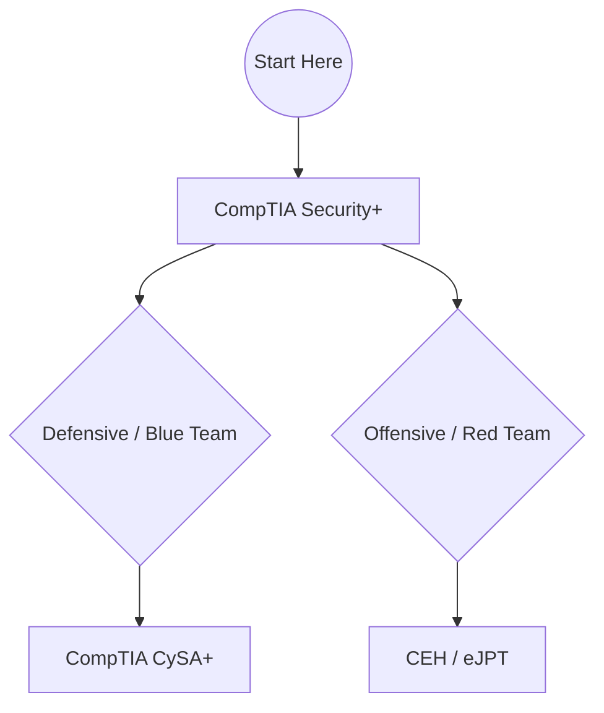

# 🛠️ Module 05: Tools, Certifications & Resources

To become a professional in Cyber Security, you must continuously learn and prove your skills.

---

## 🏆 Certification Roadmap

---

## 🎮 Free Practice Platforms

Never test on live environments without permission. Use these safe platforms:
1. **[TryHackMe](https://tryhackme.com/):** The best platform for beginners.
2. **[HackTheBox](https://www.hackthebox.com/):** For intermediate to advanced users.
3. **[PortSwigger Academy](https://portswigger.net/web-security):** Free training on web vulnerabilities.

---
🎉 **Congratulations! You have explored all the core modules.**

⬅️ **[Back to Module 04](../04-Ethical-Hacking-Labs/README.md)**
